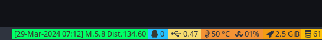

# This project will query the latest earthquake alerts

> still learning... (⌒‿⌒)/

Querying the last earthquake from my location with a radius of 320km,
saving a smaller set of data in influxdb for grafana & in a small file for my i3Status bar.
Data are queried from https://earthquake.usgs.gov

# Tasks

## TODO
  - [ ] Clean 
  - [ ] Optimization


# Getting started

## Instal Rust & Cargo
Install Rust on your local machine, to do so please follow the official documentation

[Rust get started](https://www.rust-lang.org/learn/get-started)


## Get a local copy using git

```bash
git clone git@github.com:lunarust/wobblealert.git
```

## Start the application:

Copy ./src/config/Development.toml to Default.toml

```bash
cd src
cargo run
```

## Details:
### InfluxDB 

Data stored as:

| result|table  |_start |_stop  |_time  |_value |_field |_measurement|alert|code|url|
|-------|-------|-------|-------|-------|-------|-------|------------|-----|----|----|
|_result|0|1970-01-01T00:00:00Z|2024-04-01T09:49:10.374737174Z|2023-10-13T03:33:14.082Z|10|depth|quake|green|6000lf9u|https://earthquake.usgs.gov/earthquakes/eventpage/us6000lf9u |
|_result|1|1970-01-01T00:00:00Z|2024-04-01T09:49:10.374737174Z|2023-10-13T03:33:14.082Z|122.415017|distance|quake|green|6000lf9u|https://earthquake.usgs.gov/earthquakes/eventpage/us6000lf9u |
|_result|2|1970-01-01T00:00:00Z|2024-04-01T09:49:10.374737174Z|2023-10-13T03:33:14.082Z|37.851|latitude|quake|green|6000lf9u|https://earthquake.usgs.gov/earthquakes/eventpage/us6000lf9u |


### Grafana


*Note: Need to point to a influxdb datasource - Import not tested -*

[json Dashboard](./grafana/quakes.json)


### I3Status



Configuration file:
```yaml
order += "read_file wobblealert"

read_file wobblealert {
        path = "~/.config/i3/alerti3"
        format = "%content"
        separator_block_width = 0
}
```

# Ref.
## USGS API DOC
https://earthquake.usgs.gov/fdsnws/event/1/


# MIT License


